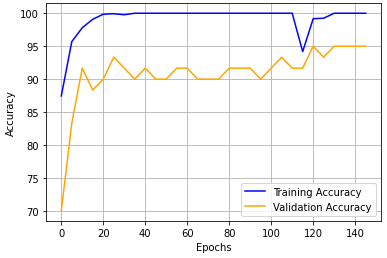
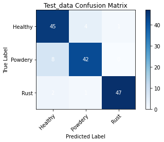

# Plant_disease_detection_website
Our project is a Flutter-based mobile application that incorporates neural networks to accurately classify plant health conditions. By leveraging the cross-platform capabilities of Flutter, users can access the intuitive and user-friendly interface on both iOS and Android devices. The neural networks, trained on a diverse dataset of plant images, analyze user-captured or uploaded plant images and provide predictions on whether the plant is healthy, affected by powdery mildew, or rust. Rigorous testing and validation ensure high accuracy rates, while user feedback contributes to ongoing improvements. This project aims to offer a reliable and convenient tool for users to assess and address plant health issues effectively.

## Directory structure
```
Data
-Train
-Validation
-Test
Models
-model.pth
src
```
## To start the Flask server:
```python3 server.py```

## Train/Validation Accuracy:


## Test Confusion Matrix


